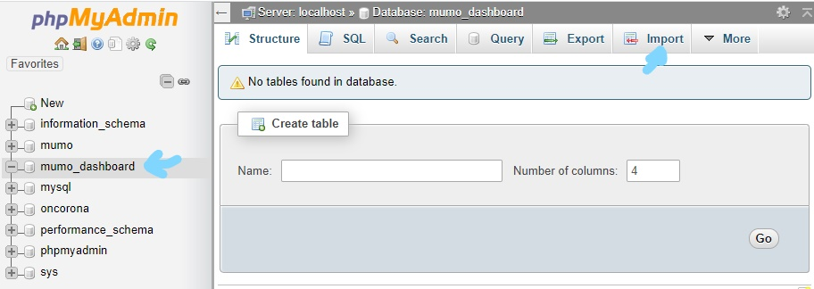
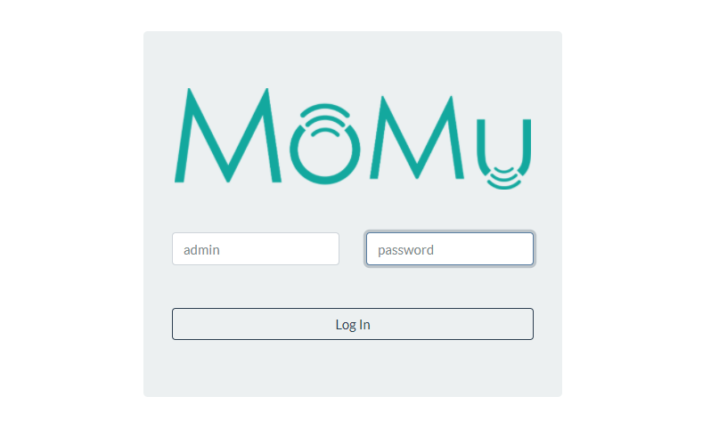
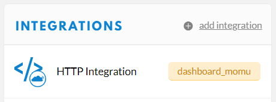

# MuMo Dashboard documentation

The MuMo dash is a platform that receives data from nodes trough the things network or via direct post packages from active gateways.  
The dashboard gives you clear overviews of all sensor's measurements and graphs over time.  
All measurements can be constricted so that out of bound measurements can be flagged and reported over mail.   
The primary application for this dashboard is monitoring over IOT sensor networks that monitor environmental conditions in a storage facility that should be kept in climatized conditions. But can be altered to host a bunch of applications.  
Also provided is a daily camera update to keep track of slow visual effects like bug traps, rodent traps, daily workspace log or others.

Please also look at our other pages for details on the custom end-nodes and active gateways. 

## Requirements
* PHP version 5.6 or greater.
* MYSQL version 5.6 or greater or MariaDB version 10.1 or greater.
* Online accessible url (may be a subdomain as well)
> Almost every webhost available online should support this.

## Settings.php
- First of all go to your webhosts settings and create a new MySQL database and user. 
    - This process varies from webhost to webhost. So check your providers documentation for details. As a general guide search for database management and add a database user. 
    - Use a different password then your webhost account please!
    - In the example i create a database called mumo_dashboard.
- Rename the `Edit_me_settings.php` file to `settings.php`. 
    - (the file is named like this so updates can be placed without a chance of overwriting this file).
- Update these settings in the settings.php file of this project `mysqli_connect("localhost","user","password","database");`
- Also update the domain name of your website and the base url. (the domain is used in emails, the base url to create direct links).
    - The url should always start with http:// or even better https:// if your site supports it. 
    - The url should link to the home folder of the website. Not to a specific page or subfolder.
    - It should not have a trailing / or file extension
    >Examples: https://example.be or http://mumo.example.be or https://example.be/mumo
- If you want a different logo or project name, these can also be changed here.
- The bottom of the settings.php file contains a measurements list that contains all types of measurements that can be entered into the dashboard. This tells the dashboard how to call and handle all measurements. You can add all custom measurements to the back of this list. For visual purposes limiting it to 7 measurements per sensor is advised.
- Options:
    - Print_name: Name to be shown in the website
    - Variable_name: How the data is named in the endpoint data from TTN and in the platform and database (no capitals or strange characters)
    - Unit: Unit to be printed after the values
    - Type: Datatype (determines how to present the data)[options: float (2 decimal places), big_float(4 decimal places), int(no decimal places)]
    - Color: Color to use in the charts
    - Calibration: Limiting range in the calibration settings
    - Range: probible range the values will fall within (limits the alert ranges)


## Database setup
- Then we need to setup our database. Therefore, go to the phpMyAdmin page of your domain (often also to be found in your webhosts portal as phpMyAdmin or database access). Open the database you just created on the left (e.g.: mumo_dashboard). 

- Go to import with the button on top, upload the database.sql file from the root of the project and click Go. This will install all tables needed for the project. In case of errors popping up, please open a bug report here on GitHub so we can help.
- The final thing to alter is to make sure you have an account to login to on the dashboard. Open the users database and edit the email address of the admin user. You can also change the users name and login now if you prefer.   
(the name is what is shown in the dashboard, the login is what you prefer to login with).
 
The password will be edited later, so leave this for now. This is a hashed and encrypted representation. So if you edit here you will not be able to login with that password. If you did edit already, here is the hash to overwrite it again: 
```$2y$10$rL5CX0JADSAH2ZyeFlpj1OWgm4q/m20Ta.fjTA9wj456q8NsXtof2```

## Deploy
- Deploy all files of this project to your webhost. This is normally in the public_html folder.
- Go to your url and you should get a login page without any errors above. Again, if you see any errors, please report them in the bug report section on GitHub.
- Login using either the stock admin user or your custom entry and use the password "password"
 
- You should now be logged in and see the home of the dashboard.

## How the platform works

### Dashboard
- On the dashboard you get an overview of your sensors last measurements as well as battery level and signal strength.
- On the bottom also the bug traps latest image is shown. 

### Global Settings
- In the left top (next to Dashboard home now) will always be a settings button. Depending on the page you are on this might be global settings or settings for the opened device. Please open these settings now.
- You see here sections of settings like 'user accounts', 'groups and devices' and 'global hardware alerts'.
- Check the site endpoint url. If it shows any alerts you must check back in the settings.php file for the base $url. See the list of instructions in the settings.php section up above. 

    ## Setting up the ***endpoint*** in TTN
    - A small deviation from the explication of the functions of the settings is the Endpoint url that has to be registered with TTN (the things network) in order to receive data from your sensors.
    - Go to [thethingnetwork.org](https://www.thethingsnetwork.org/) and login to your account.
    - In your application that you would like to connect open the ***integrations*** tab.
    - Click `add integration` and choose for an `HTTP integration`.
    - Give your process a unique ID of you own liking and select the default acces key.
    - Enter the endpoint url as found in the dashboard settings.
    - Leave the rest of the settings as stock with method being Post and the rest of the options empty.
    - Click `Add integration` and all should be fine. 

    

    - If you have an active endpoint: these will start showing up in the dashboard as soon as they transmit data. 
    - If you don't receive any data from your sensors. Open the endpoint URL yourself in the browser. You should receive a message saying: `Mumo: endpoint is active.`. If not, check your server setup and url for any errors.

    - This endpoint URL is also used in our custom active gateways python code. They transmit their readings directly to the dashboard without TTN.

#### Users
- In user accounts you can invite new users by adding their email address and screen name. They will receive an invite to choose their login name and password (please do tell them to check their spam folder).
- Here you can also change your account and you should certainly change your password. Using the send reset link by email.
- Users are grouped in 2 types. With or without editing rights. Users without editing rights see the exact same page as you do. But the settings button on the top left of every page is just an icon for them.

#### Groups and devices
- For now no groups or devices will be present. You can already start adding your group structure for your application now.   
Groups can be nested as much as you want. But visually we advise to keep it limited.
- To add devices, the dashboard just needs to receive some data input from them. They will show up as unregistered as soon as their first transmission is received. It is easier to place them into groups later (otherwise you would have to register them using long identification numbers).

#### Global hardware alerts
- These values count as the boundaries wherein data may be received. If any data received falls without these bounds it will trigger a warning and email.
- The alerts are split in local (sensor) alerts and global alerts. This means that every sensor without modification will follow the global alerts. Only if the local sensor alert is set it overrules these global set values.
- Alerts are also split in hardware and sensor alerts. For example, the battery level and signal quality can be forwarded to a manager in the building. Whereas the sensor values can be sent to the maintainers of a specific collection.
- Check the checkbox in front of the line to activate the alert. Or uncheck the box to remove the alert again.
- As a safety precaution only users that have completed their registration are accepted to receive alerts. So, we are sure they cleared the emails from being marked as spam.

Emails will be sent as soon as a sensor goes out of bound on one of these triggers. A closing email will be sent when the trigger is cleared and thus the values are again within bounds. Or, if the alert lasts more than a day it will repeat the email daily until resolved.

### Sensor settings
- If you open a sensor before clicking the settings button you will enter the sensor settings.

### Information
- Here you can alter the name, location and note of the sensor.
- If you provide a url this will be shown as a link icon after the name of this sensor. This can be used to link to its location or collection details.

### Calibration
- You can provide offsets that need to be corrected on the measurements from the device. Please note this will impact the future measurements but it will not update past measurements.

### Iframe pages
- These links can be used to place information from a sensor in a different webpage. If you want to place up to date information you can place these wherever you want. These will be visible for anyone who wants (so are not limited to registered users).
- Options will follow to adjust what will be shown and what the overview will look like.

### Local alerts
- On top of the alerts section it will show whether the settings are the global ones or have been overruled by local settings. They work exactly the same as the global ones. But this way you can make exceptions in whatever way you want to the global ones.
